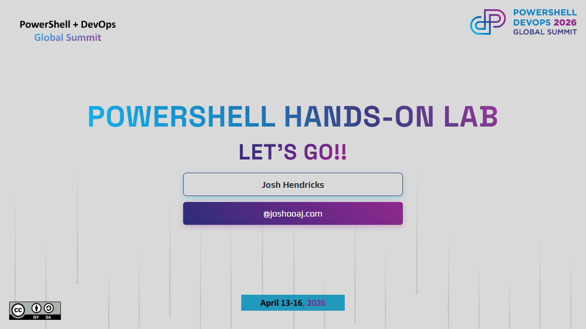

# PowerShell Hands-on Lab

<table>
    <tr>
        <td><b>When</b></td>
        <td>Thursday April 16, 2026 at 1:15pm</td>
    </tr>
    <tr>
        <td><b>Where</b></td>
        <td>Room 409</td>
    </tr>
    <tr>
        <td><b>Duration</b></td>
        <td>4 hours</td>
    </tr>
    <tr>
        <td><b>Level</b></td>
        <td>100 (Beginner)</td>
    </tr>
    <tr>
        <td><b>Categories</b></td>
        <td>PowerShell</td>
    </tr>
</table>

## Description

This hands-on lab is based on the fourth edition of the popular book
[Learn PowerShell in a Month of Lunches](https://www.manning.com/books/learn-powershell-in-a-month-of-lunches).
It is not required reading, but I do recommend picking up a copy so that you can
work through the book and exercises on your own at a more leisurely pace.

This lab will have you drinking from the firehose as we speed-run through must-know
concepts including how to use the built-in help system, the differences between
native commands, cmdlets, and functions, how objects and pipelines works, how to
work with variables, control-flow, loops, and more.

## Some Perspective

In **Learn PowerShell in a Month of Lunches**, the authors estimate that you will
average ~40 minutes per chapter, with the main content spread over 25 chapters.
At that pace it would take ~1000 minutes, or nearly 17 hours, to get through the
content.

We have about 4 hours. That *will not* be enough time to properly digest and learn
all of the concepts we will cover, and *that's okay*! My goal is that you have
a couple **ah ha!** moments, and that we plant some new seeds of knowledge for
you to cultivate over the next few months as you put what you've learned this week
to use solving real problems in your daily work.

If you don't understand something today, please **ask questions**! I guarantee if
you aren't sure about something, there is at least one other person in the room
wondering the same thing. We will do our best to cover all of the content in the
available time, but we can absolutely slow down and expand on a particular topic
if needed.

## Format

This is a hands-on lab so after introducing some new concepts, we will switch to
VS Code where I will talk through the exercises and we will run the code together.
There will be one or two other experienced PowerShell community members available
to help. Once everyone has had a few minutes to run the code and see the results,
we will repeat the process until we have (hopefully) covered all 7 blocks.

## Blocks

The content for this workshop is loosely grouped into 7 "blocks" as outlined
in the table below.

| Block       | Topics                                     | Chapters |
| ----------- | ------------------------------------------ | -------- |
| **Block 1** | The Shell & Running Commands               | 1–4      |
| **Block 2** | Providers & the Pipeline                   | 5–6      |
| **Block 3** | Modules & Objects                          | 7–9      |
| **Block 4** | Pipeline Deep Dive, Formatting & Filtering | 10–12    |
| **Block 5** | Remoting, Jobs & ForEach                   | 13–15    |
| **Block 6** | Variables, I/O & Scripting                 | 16–22    |
| **Block 7** | Logic, Errors, Debugging & Tips            | 23–27    |
